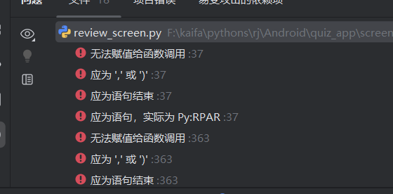

# 刷题系统 Android版本

## 项目简介
这是一个基于Kivy开发的Android刷题系统，支持题库管理、在线刷题、错题复习等功能。

## 功能特性

### 1. 用户管理
- 用户注册/登录
- 多用户切换
- 用户数据统计

### 2. 题库管理
- 支持JSON格式题库导入
- 自动识别题库文件
- 多题库切换

### 3. 刷题模式
- **即时反馈模式**：每答一题立即显示对错
- **批量答题模式**：全部答完后统一判分
- 支持打乱题目顺序
- 支持打乱选项顺序
- 实时显示正确率

### 4. 复习模式
- **错题复习**：专门练习做错的题目
- **收藏复习**：复习收藏的重点题目
- **随机复习**：随机抽取20题练习
- **全部复习**：复习题库所有题目

### 5. 学习辅助
- 题目收藏功能
- 掌握状态标记
- 错题本自动记录
- 答题历史记录
- 学习曲线统计

### 6. 题型支持
- 单选题
- 多选题
- 判断题

## 安装依赖

```bash
pip install kivy==2.3.0
```

## 运行方式

### 开发环境运行
```bash
cd quiz_app
python main.py
```

### 打包Android APK

1. 安装Buildozer（Linux/Mac）：
```bash
pip install buildozer
```

2. 在Android目录下执行：
```bash
buildozer android debug
```

3. 生成的APK文件在bin目录下

### Windows打包工具
推荐使用 [Buildozer Windows](https://github.com/Chronolaw/buildozer-windows) 或在WSL中使用buildozer。

## 题库格式

题库文件为JSON格式，存放在`question_banks`目录下：

```json
{
  "name": "题库名称",
  "questions": [
    {
      "index": 0,
      "type": "single",
      "text": "题目内容",
      "options": {
        "A": "选项A",
        "B": "选项B",
        "C": "选项C",
        "D": "选项D"
      },
      "answer": "A"
    }
  ]
}
```

### 题型说明
- `single`: 单选题，答案为单个字母如 "A"
- `multiple`: 多选题，答案为多个字母如 "ABC"
- `judge`: 判断题，答案为 "A"(对) 或 "B"(错)

## 数据存储

- **数据库**: SQLite (quiz_system.db)
- **题库**: JSON文件 (question_banks/*.json)
- **存储位置**: 
  - 开发环境: 程序所在目录
  - Android环境: 应用数据目录

## 项目结构

```
quiz_app/
├── main.py              # 主程序入口
├── database.py          # 数据库操作
├── quiz_engine.py       # 刷题引擎
├── user_manager.py      # 用户管理
├── review_module.py     # 复习模块
├── question_bank.py     # 题库管理
├── quiz_app.kv          # Kivy配置文件
└── screens/             # 界面模块
    ├── login_screen.py  # 登录界面
    ├── main_screen.py   # 主界面
    ├── quiz_screen.py   # 刷题界面
    └── review_screen.py # 复习界面
```

## 技术栈

- **Python 3.x**
- **Kivy 2.3.0** - 跨平台GUI框架
- **SQLite3** - 本地数据库
- **Buildozer** - Android打包工具

## 注意事项

1. Android首次运行需要授予存储权限
2. 题库文件需要手动放入question_banks目录
3. 建议定期备份quiz_system.db数据库文件
4. 打包APK前需配置buildozer.spec中的签名信息

## 开发者

作者：兲samsara  
版本：V1.0.0  
更新日期：2026/6/16

## 许可证

本项目仅供学习交流使用。
